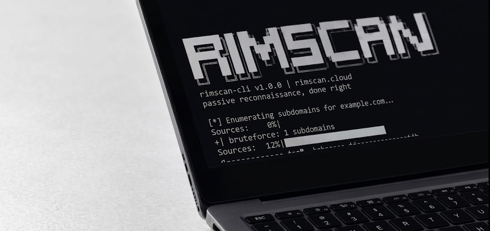

# Rimscan CLI

Rimscan CLI is a standalone, database-free passive reconnaissance tool for
authorized security testing. It discovers subdomains, resolves DNS and CNAME
chains, audits DNS and TLS configuration, checks for common exposed secrets,
and identifies possible subdomain takeover candidates using public
fingerprints.

**Only scan domains you own or have explicit written permission to test.**
This tool is not a license to scan arbitrary third-party infrastructure.

## Installation

```bash
python -m venv .venv
# Windows: .venv\Scripts\activate
source .venv/bin/activate
python -m pip install -r requirements.txt
```

## Usage

```bash
python -m rimscan_cli scan example.com --output results.json
python -m rimscan_cli scan example.com --authorized --secrets
python -m rimscan_cli scan example.com --authorized --zone-transfer --nuclei
```

The startup banner is printed to the terminal on normal scans. Use
`--quiet` (or `--no-banner`) for automation and clean machine-readable output.
The banner is also suppressed automatically when `--output` is provided.

The `--secrets` option performs HTTP requests to common public paths and
therefore requires an explicit `--authorized` confirmation. Results are printed
as JSON and can also be written with `--output`.

When `--nuclei` is used, the CLI invokes Nuclei with the fixed exclusion:

```text
-etags dos,fuzz,intrusive
```

The standalone CLI does not include Katana crawling, deep-scan tags, fuzzing,
SQL injection or XSS templates, SaaS authentication, billing, quotas,
notifications, a dashboard, Postgres, Redis, or Celery.

## Scope and safety

This repository intentionally performs discovery and standard read-only
auditing. It does not attempt exploitation or intrusive testing. Respect
provider terms, rate limits, and the scope of the authorization you received.

## Rimscan — the hosted platform

`rimscan-cli` is a command-line tool. It runs locally, on demand, from your
terminal and performs one-off passive reconnaissance: subdomain enumeration,
DNS and certificate audits, secret exposure checks, and subdomain takeover
detection.

[Rimscan](https://rimscan.cloud) is the hosted web platform built around this
engine. It is not a CLI: you sign up, add a domain through the dashboard, and
Rimscan handles scanning continuously instead of requiring you to run commands
yourself.

Rimscan adds:

- **Continuous monitoring** — targets are automatically re-scanned roughly
  every two days, so new exposures can be caught without remembering to run
  the CLI again.
- **Deep Scan (active testing)** — active crawling via Katana and payload-based
  testing for vulnerabilities such as SQL injection and XSS. This is
  intentionally outside the scope of this open-source CLI.
- **Centralized dashboard** — domains, scan history, and findings in one place
  instead of scattered JSON output files.
- **Findings management** — severity breakdowns, CVE identification, and a
  triage workflow for marking findings as resolved or false positive.
- **Team-friendly workflows** — ongoing visibility across multiple domains for
  companies and security teams, rather than only one-off researcher scans.
- **Email alerts** — notifications when new findings are discovered, instead
  of requiring manual checks.


## Coming soon
A hosted version with continuous monitoring, active vulnerability testing (Deep Scan), and a dashboard is in development.

Star this repo to follow progress.

## Development

```bash
python -m pytest
python -m rimscan_cli --help
```

## License

This project is available under the Elastic License 2.0. See [LICENSE](LICENSE)
for the complete license text. The takeover fingerprints are sourced from
[can-i-take-over-xyz](https://github.com/EdOverflow/can-i-take-over-xyz);
review that project's terms before redistributing the fingerprint data.
